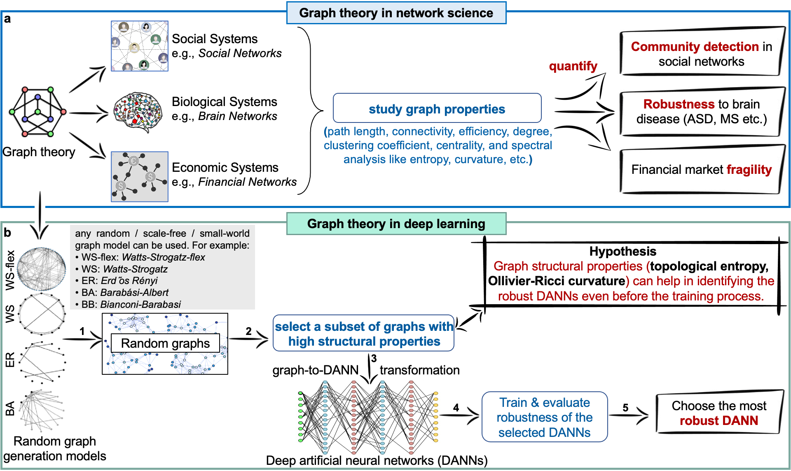

# RobDanns
[](https://pytorch.org/get-started/previous-versions/#v140)
[](https://www.mathworks.com/products/new_products/release2020a.html)
[](https://doi.org/10.48550/arXiv.2106.15850)
[](https://github.com/facebookresearch/graph2nn)
[](https://github.com/facebookresearch/pycls)


This repository is the official implementation of our article, [`Exploring robust architectures for deep artificial neural networks`](https://doi.org/10.1038/s44172-022-00043-2), published at [Nature Communications Engineering](https://www.nature.com/commseng/) on 17 December 2022.

## Contents

- [Overview](#overview)
- [Repo Contents](#repo-contents)
- [Code Setup](#code-setup)
- [Plots](#plots-for-results)
- [License](./LICENSE)
- [Issues](https://github.com/Waasem/RobDanns/pulls)
- [Citation](#citation)

## Overview

Deep artificial neural networks (DANNs) have varying predictive performance when their architectures change. How robustness is related to the architecture of DANN is still under-explored topic. In this work, we study the robustness of DANNs vis-a-vis their underlying graph architectures or structures. `RobDANNs` (Robust DANNs) are the architecture of neural networks that have high robustness properties against natural and malicious noise in the input data. This study encompasses three parts:

- Explore the design space of architectures of DANNs using graph-theoretic robustness measures.
- Transform the graphs to DANN architectures to train/validate/test on various image classification tasks.
- Explore the relationship between the robustness of trained DANNs against noise and adversarial attacks and the robustness of their underlying architectures estimated via graph-theoretic measures.

This work shows that the topological entropy and Olivier-Ricci curvature of the underlying graphs can quantify the robustness of DANNs. This relationship is stronger for complex tasks and large/deep DANNs. Our work offers a novel approach for autoML and neural architecture search community to quantify robustness of DANNs through graph curvature and entropy. We believe that this work will have a high impact on the acceptability of safety-critical AI applications. Please refer to our paper for the details.

**TLDR**: We explore neural networks for their robustness against adversarial attacks through the lens of graph theory. The graph theoretic tools successfully employed in network science (NetSci) have been used to quantify robustness of artificial neural networks (ANNs).

<div align="center">
        
        <p align="center"><b>Overview.</b> Exploring robustness of deep artificial neural networks (DANNs) with graph-theoretic measures.</p>
</div>

## Repo Contents

The repository has two parts:
- [`Deep learning`](deep_learning): `Deep learning code` for exploring the DANNs using [WS-flex](https://arxiv.org/abs/2007.06559) random graph generator. The directory itself is a modified version of **[graph2nn]( https://github.com/facebookresearch/graph2nn)** linked to the paper [Graph Structure of Neural Networks](https://arxiv.org/abs/2007.06559). The code is built upon **[pycls](https://github.com/facebookresearch/pycls)**, an image classification codebase built by FAIR.
- [`Graph theory`](graph_theory): `Graph theory code` where graph theoretical properties of architectures of DANNs are calculated. We use [MATLAB-R2020a](https://www.mathworks.com/products/new_products/release2020a.html) to carryout calculations in the graph theory and network science domain.

## Code setup

### 1 Deep Learning Domain

**Requirements:**

- NVIDIA GPU, Linux, Python3
- PyTorch, Python packages with installation instructions found below.

**Python environment:**
Use Conda or virtualenv package manager

```bash
conda create -n RobDanns python=3.6
conda activate RobDanns
```

**Pytorch:**
Install [PyTorch](https://pytorch.org/) with **CUDA** support (CPU version is not supported). The code has been verified with PyTorch 1.4.0 and torchvision 0.5.0.

```bash
pip install torch==1.4.0 torchvision==0.5.0 torchattacks==3.2.1
``` 

**Clone RobDanns repository and install:**

```bash
git clone https://github.com/Waasem/RobDanns.git
cd RobDanns/deep_learning
pip install -r requirements.txt
python setup.py develop
```
**Download datasets:**

Download [`CIFAR-10 dataset`](https://www.cs.toronto.edu/~kriz/cifar.html), [`CIFAR-100 dataset`](https://www.cs.toronto.edu/~kriz/cifar.html), [`TinyImageNet dataset`](http://cs231n.stanford.edu/tiny-imagenet-200.zip), [`ImageNet dataset`](https://image-net.org/download)
Uncompress the datasets then link the datasets with our code using following commands.

```bash
# CIFAR-10
mkdir -p pycls/datasets/data
wget https://www.cs.toronto.edu/~kriz/cifar-10-python.tar.gz
tar -xvf cifar-10-python.tar.gz
DIR=$(readlink -f cifar-10-batches-py)
ln -s $DIR pycls/datasets/data/cifar10 # symlink

# CIFAR-100 (optional)
mkdir -p pycls/datasets/data
wget https://www.cs.toronto.edu/~kriz/cifar-100-python.tar.gz
tar -xvf cifar-100-python.tar.gz
DIR=$(readlink -f cifar-100-python)
ln -s $DIR pycls/datasets/data/cifar100 # symlink

# TinyImageNet (optional)
mkdir -p pycls/datasets/data
wget http://cs231n.stanford.edu/tiny-imagenet-200.zip
# unzip and link the directory 
ln -s (path to tinyimagenet200) pycls/datasets/data/tinyimagenet200 # symlink

# ImageNet (optional)
mkdir -p pycls/datasets/data/imagenet
# Then download ImageNet following their official website
ln -s (path to ImageNet) pycls/datasets/data/imagenet # symlink
```
The expected dataset structures are explained in [DATA.md](./deep_learning/docs/DATA.md) file.

**Run the code:**

A clean repo for reproducing multiple experimental setups related to deep learning code is provided here.
The raw experimental configs related to all datasets available in [deep_learning/configs/baselines/](deep_learning/configs/baselines/) directory. For individual experiments, the .yaml files in each sub-directory of [deep_learning/configs/baselines/](deep_learning/configs/baselines/) can be used as training configuration.

**Run the model for training:**

Train your DANN models through following commands.

```bash
# Explaining the arguments:
# Tasks: mlp_cifar10, cnn_ cifar10, cnn_cifar100, resnet18_tinyimagenet, resnet18_tinyimagenet
# Division: all
# GPU: 1
cd RobDanns/deep_learning
bash launch.sh mlp_cifar10 all 1
bash launch.sh cnn_cifar10 all 1
bash launch.sh cnn_cifar100 all 1
bash launch.sh resnet18_tinyimagenet all 1
bash launch-tinyimagenet.sh resnet18_tinyimagenet all 1
```

### 2 Graph Calculations
Given in the [Graph theory](graph_theory) directory. The code in this directory is based on MATLAB. Here we calculate the graph measures of our DANNs. We recommend using [Matlab R_2020a]( https://www.mathworks.com/products/new_products/release2020a.html).  Because of the large number of experiments and huge space requirements for files containing the Adjacency Matrices (~100GB), we have not uploaded these files. However, here we present a method to find the adjacency matrices of the graphs and the code to perform the graph-theoretical analysis on the generated graphs, as given below:

**Graph generation:**

Before running this code part, we need to find and store the Adjacency Matrices of graphs of architectures of our DANNs. We have placed a notebook file [generate_graphs.ipynb](deep_learning/analysis/generate_graphs.ipynb) in the [`Deep learning/analysis`](deep_learning/analysis) directory. This notebook can be used to generate Adjacency Matrices for our Relational Graphs experiments. In our experiments, we generate 2.313 Million WS-flex graphs, sub-sample them through coarse bins to 3854, 441, and 54 graphs. These sub-sampled graphs along with the corresponding Adjacency Matrices can be saved for analysis in the graph theory domain. Similar methodology can be followed to generate and save graphs from any random graph generator.

**Calculate graph-theoretic measures:**

Once we have Adjacency Matrices of our graphs, we can feed them as input to the file [main.m](graph_theory/main.m). For each of the graph models, users can comment / uncomment the code blocks in this file and run the code. The resulting .mat file would contain the Adjacency matrix, degree, clustering coefficient, average path length, characteristic path length, global efficiency, algebraic connectivity, entropy, and curvature. Note: this can be a time consuming process.

## Plots for results

The plots for our experimental results reported in our main paper as well as the supplementary section are located in the directory [figs](deep_learning/docs/figs). The statistical analysis results reported herein were performed in the Microsoft Excel's Data Analysis toolbox.
-	Accuracy Plots for all Experiments: The predictive accuracy (in %) plots of all DANNs on respective datasets are compiled in [Accuracy Results](deep_learning/docs/figs/accuracy_results_all.png) file.
-	Robustness Plots for all Experiments: Graph entropy values for structures of DANNs and their corresponding predictive performance under various types and levels of insults are given in the figures for each dataset ([ImageNet](deep_learning/docs/figs/corr_acc_ent_Res18_ImageNet.png), [Tiny-ImageNet](deep_learning/docs/figs/corr_acc_ent_Res18_TinyImageNet.png), and [CIFAR](corr_acc_ent_CNN_Cifar100_Cifar10.png)). Results from additional simulations are given in the [Supplementary Figs](deep_learning/docs/figs/supplementary_figs) directory. For graph curvature vs. accuracy analysis, please turn to Appendix C of our paper.
-	Task and Model Complexity Plots: The effect of graph entropy on DANNs having varying depth as well on tasks having varying complexity is given in the figure [Complexity Plots](deep_learning/docs/figs/task_model_complexity_plots.png). One can notice that as the complexity of the model and/or dataset increases, the importance of entropy as the robustness-measure of DANNs increases significantly.

## Citation
Waqas, A., Farooq, H., Bouaynaya, N.C. et al. Exploring robust architectures for deep artificial neural networks. Commun Eng 1, 46 (2022). https://doi.org/10.1038/s44172-022-00043-2

## Thank You !
Suggestions and improvements are welcome.

